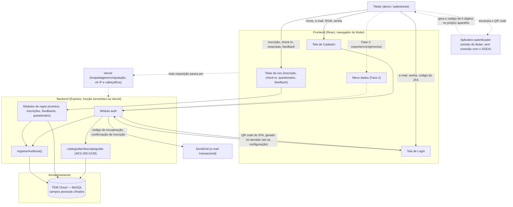

# Inventário de dados pessoais e fluxo de dados — SGEA

**Data:** 28/09/2026 · **Versão:** 2 (inclui a autenticação em dois fatores,
o uso do IP no limite de tentativas e a remoção do telefone do palestrante)

Responde, para cada dado pessoal tratado pelo SGEA, às perguntas da seção 1
do guia. A finalidade específica e a hipótese legal de cada um estão
detalhadas em `02-matriz-dados-finalidade-base-legal.md`; aqui o foco é
**onde** cada dado entra e circula no sistema.

## 1. Nome, e-mail institucional, RGM (aluno)

- **De quem é:** do aluno que se cadastra.
- **Onde é coletado:** tela pública de Cadastro (`frontend/src/pages/Cadastro/CadastroPage.tsx`),
  enviado a `POST /api/auth/registro`.
- **Obrigatório ou opcional:** obrigatório — não é possível criar conta sem os três.
- **Onde fica armazenado:** tabelas `usuarios` e `participantes`, colunas
  `nome`/`emailLogin`/`email`/`rgm`, cifradas em repouso (AES-256-GCM,
  `backend/src/utils/criptografia.ts`); índices de busca (`emailLoginHash`,
  `emailHash`, `rgmHash`) são HMAC, não reversíveis.
- **Por quanto tempo:** ver `04-plano-de-retencao-e-descarte.md`.
- **Quem consulta/altera:** o próprio titular (visão própria, hoje limitada
  a `GET /usuarios/me`; a Fase 2 adiciona edição na página "Meus dados");
  ADMINISTRADOR/SECRETARIA podem consultar e editar via tela de
  Participantes.
- **Compartilhado com terceiro:** SendGrid recebe o e-mail e o nome como
  destinatário de mensagens transacionais. Nenhum dos três é enviado a
  nenhum outro serviço.
- **Direitos do titular:** ver `08-procedimento-direitos-dos-titulares.md`.
- **Resposta a incidente:** ver `05-plano-de-resposta-a-incidentes.md`.

## 2. Senha

- **De quem é:** de qualquer conta (aluno, secretaria, administrador).
- **Onde é coletado:** telas de Cadastro e "Esqueci minha senha".
- **Obrigatório:** sim.
- **Onde fica:** `usuarios.senhaHash` (bcrypt, custo 10) — nunca em texto
  puro, nunca logado (`backend/src/utils/password.ts`).
- **Por quanto tempo:** enquanto a conta existir.
- **Quem consulta:** ninguém — nem a equipe, nem quem acessa o banco
  diretamente, consegue recuperar a senha original a partir do hash.
- **Compartilhado:** não.

## 3. Aceite de Termos de Uso e ciência da Política de Privacidade

- **De quem é:** de quem se cadastra.
- **Onde é coletado:** checkbox na tela de Cadastro, gravado no servidor
  (nunca confia em timestamp vindo do cliente) — `auth.service.ts`.
- **Obrigatório:** sim, pra criar conta (`z.literal(true)` no schema de
  registro).
- **Onde fica:** `usuarios.consentimentoLgpdEm` (data/hora) e
  `usuarios.versaoTermosAceitos` (qual versão do Termos/Política foi aceita).
- **Quem consulta:** equipe, via trilha de auditoria (`CONSENTIMENTO_LGPD_ACEITO`).
- **Compartilhado:** não.

## 4. Inscrição, presença (check-in), respostas do questionário

- **De quem é:** do aluno inscrito.
- **Onde é coletado:** autoinscrição do próprio aluno
  (`POST /eventos/:id/inscricoes`) ou inscrição manual pela secretaria;
  check-in feito pela equipe na tela correspondente; respostas enviadas
  pelo próprio aluno na tela de Questionário.
- **Obrigatório:** obrigatório pra quem quer participar do evento e emitir
  certificado.
- **Onde fica:** tabelas `inscricoes` e `tentativas_questionario`.
- **Quem consulta:** o próprio aluno (só as próprias); equipe (todas, sem
  virar ranking exposto a outro aluno — `questionario.routes.ts`).
- **Compartilhado:** não.

## 5. Feedback da palestra

- **De quem é:** do aluno que avalia.
- **Onde é coletado:** tela de Feedback, só liberada para eventos em que o
  aluno já tem certificado (presença + nota mínima).
- **Obrigatório:** opcional.
- **Onde fica:** tabela `feedbacks` (nota + comentário em texto livre).
- **Quem consulta:** o próprio autor; equipe (todos, com média por evento).
- **Compartilhado:** não.

## 6. Logs de login, falha, acesso negado e mudança em registro crítico

- **De quem é:** de qualquer pessoa que interage com o sistema autenticada
  ou tenta se autenticar.
- **Onde é gerado:** automaticamente pelo backend em cada operação
  sensível (`backend/src/utils/auditoria.ts` lista todos os códigos de
  ação); nunca é um dado que o titular digita.
- **Obrigatório:** não se aplica (não é opção do titular).
- **Onde fica:** tabela `logs_auditoria` — o campo `detalhe` nunca contém
  senha, token, código ou valor de dado pessoal, só id do registro afetado
  e um motivo curto.
- **Quem consulta:** ADMINISTRADOR/SECRETARIA, tela de Auditoria.
- **Compartilhado:** não.

## 7. Código de recuperação de senha

- **De quem é:** de quem pede "esqueci minha senha".
- **Onde é coletado/gerado:** gerado pelo servidor, nunca digitado pelo
  titular (ele só digita o código que recebeu por e-mail).
- **Onde fica:** `recuperacoes_senha.codigoHash` (hash bcrypt, nunca texto
  puro), com validade de 15 minutos e limite de 5 tentativas de confirmação.
- **Compartilhado:** enviado por e-mail via SendGrid (o código em texto
  puro vai só no corpo do e-mail para o próprio titular, nunca fica em log
  do servidor — ver correção do achado (g) na Fase 2).

## 8. Nome e e-mail do palestrante

- **De quem é:** de pessoas convidadas a ministrar palestra — não são
  alunos, mas também são titulares de dados pessoais.
- **Onde é coletado:** tela de Palestrantes, preenchida pela secretaria
  (o próprio palestrante não se cadastra).
- **Onde fica:** tabela `palestrantes`, em texto puro por decisão
  justificada em `07-medidas-tecnicas-de-seguranca.md`. O telefone foi
  **removido do sistema** (minimização: não era usado em nenhum fluxo).
- **Quem consulta:** equipe (nome e e-mail); ALUNO (só o nome — o e-mail
  não vem na resposta da API para esse perfil).
- **Compartilhado:** não.

## 9. Endereço IP e metadados de requisição

- **De quem é:** de qualquer visitante do sistema, mesmo antes de logar.
- **Onde é tratado:** (1) pela infraestrutura da Vercel, que executa a
  função serverless, em qualquer requisição HTTP; (2) pelo próprio SGEA,
  só nas rotas de login e de pedido de código de recuperação de senha,
  como chave do limite de tentativas por IP
  (`backend/src/utils/limiteAcesso.ts`).
- **Onde fica:** (1) logs de execução da Vercel, fora do controle direto
  do código do SGEA; (2) tabela `limites_acesso`, coluna `chave`
  (`login:ip:<ip>` ou `recuperacao:ip:<ip>`), com o número de tentativas
  e o fim do bloqueio — nada além disso é associado ao IP.
- **Por quanto tempo:** (2) o registro permanece depois que o bloqueio
  expira (com o contador zerado); o descarte automático depende da rotina
  de retenção, ainda não implementada.
- **Compartilhado:** com a Vercel (operador de hospedagem/computação).

## 10. Segredo e códigos de recuperação da autenticação em dois fatores

- **De quem é:** de ADMINISTRADOR e SECRETARIA (obrigatório) e do ALUNO
  que decidir ativar (opcional).
- **Onde é gerado:** pelo servidor, quando o titular inicia a configuração
  (primeiro login da equipe, ou página "Minha conta" do aluno). O QR code
  com o segredo é gerado no próprio servidor do SGEA e mostrado só na tela
  de configuração; o titular o escaneia com um aplicativo autenticador
  instalado no próprio celular, que passa a gerar os códigos de 6 dígitos
  sem nenhuma conexão com o SGEA.
- **Obrigatório ou opcional:** obrigatório para ADMINISTRADOR e SECRETARIA;
  opcional para ALUNO.
- **Onde fica:** segredo em `usuarios.mfaSegredoCifrado` (AES-256-GCM),
  junto com `mfaAtivo`, `mfaAtivadoEm` e `mfaUltimoPasso` (contra reuso do
  mesmo código); os 8 códigos de recuperação em `codigos_recuperacao_mfa`,
  só como hash (HMAC-SHA256).
- **Por quanto tempo:** enquanto o 2FA estiver ativo; tudo é apagado
  quando o aluno desativa ou o administrador reseta.
- **Quem consulta:** ninguém depois da configuração — a API não devolve
  mais o segredo, e os códigos de recuperação só aparecem na ativação.
- **Compartilhado:** não. Não há SMS, e-mail nem API externa de QR code no
  fluxo.

## Diagrama do fluxo de dados

Nenhum dado pessoal sai do trajeto acima: não há chamada a serviço de IA,
analytics ou CDN de terceiro a partir do frontend (confirmado em
`frontend/index.html` e `frontend/package.json` — só React, React Router e
jsPDF, este último rodando inteiramente no navegador do próprio titular
para gerar o PDF do certificado, sem enviar nada a lugar nenhum). No
backend, as bibliotecas do 2FA (`otplib` para o TOTP e `qrcode` para a
imagem do QR code) rodam dentro da própria função serverless, sem chamar
serviço externo.
